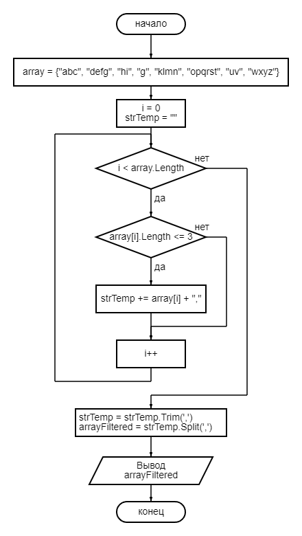

# Итоговая проверочная работа

## Задача

Написать программу, которая из имеющегося массива строк формирует массив из строк, длина которых меньше либо равна 3 символам.

## Решение

Для начала создадим массив, который будем фильтровать:

```C#
string[] array = {"abc", "defg", "hi", "g", "klmn", "opqrst", "uv", "wxyz"};
```

И выводим его в консоль для удобства проверки результата:

```C#
Console.WriteLine();
Console.WriteLine("Исходный массив:");
Console.WriteLine($"[\"{String.Join("\", \"", array)}\"]");
Console.WriteLine();
```

Фильтровать массив будем с помощью метода, в который будем передавать исходный массив. Для этого объявляем его:

```C#
string[] ArrayFilter(string[] array)
```

Поскольку нам заранее не известен размер итогового массива, мы будем найденные значения записывать в строку, используя в качестве разделителя запятую. Эту строку мы впоследствии преобразуем в массив. Для этого в теле метода объявляем строковую переменную и присваиваем ей пустое значение:

```C#
string strTemp = "";
```

> Следует заметить, что в данном случае мы не должны при вводе элементов исходного массива использовать запятую

Затем циклом проходим по каждому элементу исходного массива. Если длина элемента меньше, либо равна 3, то к переменной `strTemp` мы прибавляем значение этого элемента плюс запятая:

```C#
for (int i = 0; i < array.Length; i++)
        if (array[i].Length <= 3) strTemp += array[i] + ",";
```

Полученную строку нам нужно преобразовать в массив с помощью метода `Split()`. Но, поскольку в результате выполнения операций в цикле наша строка теперь заканчивается запятой, метод `Split()` будет писать в массив один лишний элемент. равный пустому значению. Чтобы этого избежать, просто "отрежем" последнюю запятую:

```C#
strTemp = strTemp.Trim(',');
```

Объявим новый массив `arrayFiltered` и сразу же запишем в него элементы из строки `strTemp`:

```C#
string[] arrayFiltered = strTemp.Split(',');
```

Возвращаем новый массив:

```C#
return arrayFiltered;
```

И выводим его в консоль:

```C#
Console.WriteLine("Отфильтрованный массив:");
Console.WriteLine($"[\"{String.Join("\", \"", ArrayFilter(array))}\"]");
Console.WriteLine();
```

Алгоритм выполнения этой задачи можно представить в виде блок-схемы:
